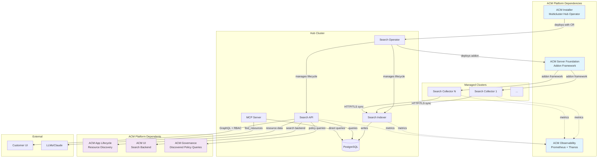

# ACM Search Architecture

## Live Fleet Overview
- Current fleet composition: !`find_resources --outputMode=summary`
- Managed clusters: !`find_resources --kind=ManagedCluster --outputMode=count --groupBy=status`
- Total indexed resources: !`find_resources --outputMode=count --groupBy=kind --limit=10`

## ACM Platform Integration Graph



**Key Integration Points:**
- **🔵 Dependencies**: What Search needs from other ACM pillars
- **🟣 Dependents**: What other ACM pillars need from Search
- **Internal**: Search component data flow
- **External**: Customer and AI access patterns

## ACM Ecosystem Context

Search operates as part of the broader ACM platform ecosystem, not as an isolated service:

### **Platform Dependencies** 🔵
- **ACM Installer**: Deploys search operator with default configuration
- **ACM Server Foundation**: Provides addon framework for collector deployment
- **ACM Observability**: Collects metrics from all search components

### **Platform Integration** 🟣
- **ACM App Lifecycle**: Depends on search for resource discovery and topology
- **ACM UI**: Uses search as primary backend for cluster resource management
- **ACM Governance**: Queries search for discovered policy list and compliance

### **Cross-Pillar Failure Impact**
- **Search down** → App Lifecycle + UI + Governance lose core functionality
- **Observability down** → Search health monitoring lost
- **Addon Framework issues** → Collector deployment/updates fail

## Data Flow Stages

### 1. **Collection** (Collectors → Indexer)
- **What**: Resource discovery + relationship computation on managed clusters
- **How**: Kubernetes watch APIs → channel pipeline → HTTP sync to hub
- **Current Scale**: !`find_resources --kind=ManagedCluster --outputMode=count` active collectors

### 2. **Aggregation** (Indexer → PostgreSQL)
- **What**: Cross-cluster resource aggregation + relationship computation
- **How**: Batch processing + JSONB storage with relationship edges
- **Current Scale**: !`find_resources --outputMode=summary` total resources

### 3. **Query** (API → PostgreSQL)
- **What**: GraphQL queries with RBAC enforcement
- **How**: gqlgen resolvers + multi-tier caching + recursive CTEs
- **Current Load**: Serving authenticated queries for !`find_resources --outputMode=count` resources

### 4. **External** (LLMs → MCP Server → PostgreSQL)
- **What**: Programmatic access to search data for AI/automation
- **How**: LLMs request via MCP protocol → direct PostgreSQL queries (bypasses API)
- **Usage**: This conversation and other AI-powered analysis

## Component Roles & Relationships

### **Operator** (Hub Orchestrator)
- **Installs** Collectors on managed clusters via ManagedClusterAddOn
- **Manages** Indexer and API lifecycle on hub cluster
- **Coordinates** configuration distribution and updates

### **Collector** (Per-Cluster Agents)
- **Watches** local Kubernetes resources via informers
- **Computes** intra-cluster relationships (ownedBy, runsOn, etc.)
- **Syncs** data to hub Indexer via secure HTTP

### **Indexer** (Central Aggregator)
- **Receives** data from all Collectors + Hub informers
- **Stores** in PostgreSQL with hybrid JSONB + relational design
- **Computes** cross-cluster relationships and dependencies

### **API** (Query Layer)
- **Serves** GraphQL interface with RBAC enforcement
- **Queries** PostgreSQL with optimized patterns
- **Caches** authentication and authorization decisions

## System Health Overview

```bash
# Quick system status
kubectl get pods -l app=search -o wide
kubectl get managedclusteraddons search -A --no-headers | wc -l  # Active collectors
```

## When Things Break, Route To:

### **Query performance, RBAC issues** → `/search-api`
- GraphQL optimization, authentication, client integration

### **Database issues, aggregation problems** → `/search-indexer`
- PostgreSQL tuning, batch processing, relationship computation

### **Resource discovery, network connectivity** → `/search-collector`
- Kubernetes watching, cross-cluster networking, heartbeat failures

### **Deployment, configuration, lifecycle** → `/search-operator`
- Component deployment, configuration management, upgrade issues

## Key Architectural Decisions

### **Centralized vs Distributed**
- **Choice**: Single hub database for consistency and cross-cluster relationships
- **Trade-off**: Central bottleneck vs operational simplicity and data consistency

### **JSONB vs Relational**
- **Choice**: Hybrid approach - JSONB for flexibility + relational edges for performance
- **Trade-off**: Query optimization complexity vs schema evolution flexibility

### **Event-driven vs Polling**
- **Choice**: Kubernetes informers + real-time sync
- **Trade-off**: Network overhead vs data freshness

### **Single-tenant vs Multi-tenant**
- **Choice**: RBAC at query time vs data isolation
- **Trade-off**: Storage efficiency vs security boundaries

## Supporting Documentation
- [Component Relationships](component-relationships.md) - Detailed data flow patterns
- [Deployment Topology](deployment-topology.md) - Hub vs managed cluster placement
- [Scaling Architecture](scaling-architecture.md) - How architecture scales with fleet size