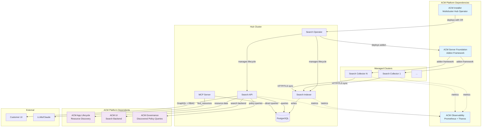

# ACM Search Architecture

## Intelligent System Assessment

!`scripts/orchestrate-assessment.sh`

## Cross-Impact Analysis & Correlation

!`scripts/correlate-results.sh`

## Symptom-Based Routing

!`scripts/route-symptoms.sh`

**🧠 Orchestrator Functions**: This skill coordinates specialized assessments:
1. **🎯 Smart Routing** - Routes symptoms to appropriate impact assessments
2. **🔗 Cross-Correlation** - Synthesizes results from multiple impact skills  
3. **📊 Architectural Reasoning** - Provides topology-aware performance insights
4. **💡 Synthesis** - Unified recommendations across all components

*The architecture skill serves as intelligent glue between search-api-impact, search-indexer-impact, search-collector-impact, and search-operator-impact.*

## ACM Platform Integration Graph



**Key Integration Points:**
- **🔵 Dependencies**: What Search needs from other ACM pillars
- **🟣 Dependents**: What other ACM pillars need from Search
- **Internal**: Search component data flow
- **External**: Customer and AI access patterns

## ACM Ecosystem Context

Search operates as part of the broader ACM platform ecosystem, not as an isolated service:

### **Platform Dependencies** 🔵
- **ACM Installer**: Deploys search operator with default configuration. The end user can customize the CR further.
- **ACM Server Foundation**: Provides addon framework for collector deployment and life cycle management.
- **ACM Observability**: Collects metrics from all search components.

### **Platform Integration** 🟣
- **ACM App Lifecycle**: Depends on search for resource discovery and topology
- **ACM UI**: Uses search as primary backend for cluster resource management
- **ACM Governance**: Queries search for discovered policy list and compliance

### **Cross-Pillar Failure Impact**
- **Search down** → App Lifecycle + UI + Governance lose core functionality
- **Observability down** → Search health monitoring lost
- **Addon Framework issues** → Collector deployment/updates fail

## Data Flow Stages

### 1. **Collection** (Collectors → Indexer)
- **What**: Resource discovery + relationship computation on managed clusters
- **How**: Kubernetes watch APIs → channel pipeline → HTTP sync to hub
- **Current Scale**: See cluster overview above for active collector count

### 2. **Aggregation** (Indexer → PostgreSQL)
- **What**: Cross-cluster resource aggregation + relationship computation
- **How**: Batch processing + JSONB storage with relationship edges
- **Current Scale**: See fleet overview above for total resources and clusters

### 3. **Query** (API → PostgreSQL)
- **What**: GraphQL queries with RBAC enforcement
- **How**: gqlgen resolvers + multi-tier caching + recursive CTEs
- **Current Load**: See resource distribution above for query-able resource count

### 4. **External** (LLMs → MCP Server → PostgreSQL)
- **What**: Programmatic access to search data for AI/automation
- **How**: LLMs request via MCP protocol → direct PostgreSQL queries (bypasses API)
- **Usage**: This conversation and other AI-powered analysis

## Component Roles & Relationships

### **Operator** (Hub Orchestrator)
- **Installs** Collectors on managed clusters via ManagedClusterAddOn
- **Manages** Indexer and API lifecycle on hub cluster
- **Coordinates** configuration distribution and updates

### **Collector** (Per-Cluster Agents)
- **Watches** local Kubernetes resources via informers
- **Computes** intra-cluster relationships (ownedBy, runsOn, etc.)
- **Syncs** data to hub Indexer via secure HTTP

### **Indexer** (Central Aggregator)
- **Receives** data from all Collectors + Hub informers
- **Stores** in PostgreSQL with hybrid JSONB + relational design
- **Computes** cross-cluster relationships and dependencies

### **API** (Query Layer)
- **Serves** GraphQL interface with RBAC enforcement
- **Queries** PostgreSQL with optimized patterns
- **Caches** authentication and authorization decisions

## Orchestration Methodology

The architecture skill coordinates specialized impact assessments based on symptoms, architectural understanding, and cross-component relationships.

### Symptom-Based Assessment Routing

**Performance Issues:**
```bash
"API slow" → search-api-impact + search-indexer-impact
"Query timeouts" → search-api-impact (RBAC overhead, GraphQL complexity)
"Database slow" → search-indexer-impact (PostgreSQL pressure, batch processing)
```

**Operational Events:**
```bash
"New cluster added" → search-collector-impact + search-indexer-impact
"Cluster removed" → search-operator-impact (addon cleanup) + search-indexer-impact
"Component restart" → search-operator-impact + affected component impact
```

**System-Wide Issues:**
```bash
"Everything slow" → Full assessment: all four impact skills
"High memory usage" → search-indexer-impact + search-operator-impact  
"Network connectivity" → search-collector-impact + search-api-impact
```

### Cross-Impact Correlation Patterns

**Cascading Failures:**
```bash
Indexer backlog → API query delays → User timeouts
Collector stress → Indexer overload → Database pressure
Operator restart loops → Component instability → Data collection gaps
```

**Root Cause Identification:**
```bash
Multiple component stress + Database slow = Central bottleneck
High API latency + Normal indexer performance = RBAC/authentication issue
Collector connection stress + Normal database = Network/scaling issue
```

### When Symptoms Point To Specific Components:

**GraphQL query performance, RBAC authentication overhead** → `search-api-impact`
- Client integration patterns, WebSocket subscriptions, user pattern analysis

**Database pressure, batch processing delays, resync storms** → `search-indexer-impact`  
- PostgreSQL diagnostics, relationship computation, capacity utilization

**Cross-cluster connectivity, resource discovery issues** → `search-collector-impact`
- Network latency, connection pool exhaustion, fleet-wide performance

**Component lifecycle, deployment failures, configuration drift** → `search-operator-impact`
- Reconciliation performance, addon deployment, resource consumption

## Usage

### Full System Assessment (Recommended)
```bash
cd .claude/skills/search-architecture
./scripts/orchestrate-assessment.sh
```
**Automatically determines assessment strategy based on recent events and system state.**

### Symptom-Based Routing
```bash
cd .claude/skills/search-architecture
./scripts/route-symptoms.sh [symptom]
```

**Available symptoms:**
- `api-slow` - GraphQL query performance issues
- `new-cluster` - Issues after adding clusters
- `everything-slow` - System-wide performance problems
- `database-issues` - PostgreSQL errors or slow queries
- `component-restart` - Pods restarting frequently
- (Interactive mode available - run without arguments)

### Cross-Impact Analysis
```bash
cd .claude/skills/search-architecture
./scripts/correlate-results.sh
```
**Synthesizes results from multiple impact assessments to identify architectural patterns.**

### Individual Component Assessments
```bash
# Run specific impact assessments directly
cd .claude/skills/search-api-impact && ./scripts/generate-assessment.sh
cd .claude/skills/search-indexer-impact && ./scripts/generate-assessment.sh
cd .claude/skills/search-collector-impact && ./scripts/generate-assessment.sh
cd .claude/skills/search-operator-impact && ./scripts/generate-assessment.sh
```

## Output Structure

**Assessment Results Location:**
- `monitoring_data/impacts/` - Individual component assessment reports
- `monitoring_data/architecture/` - Orchestration and correlation results

**Key Output Files:**
- `{cluster_id}_architecture_summary.json` - Orchestration execution summary
- `{cluster_id}_architecture_correlation.json` - Cross-impact analysis and patterns
- `{cluster_id}_architecture_orchestration.log` - Detailed execution audit trail

## Integration Benefits

### As Intelligent Glue
**search-architecture** serves as the coordination layer that:
- **Routes intelligently**: Determines which assessments to run based on symptoms
- **Synthesizes holistically**: Combines multiple assessment results into unified insights
- **Provides context**: Architectural reasoning for performance patterns
- **Reduces complexity**: One entry point for comprehensive system analysis

### Cross-Component Understanding
- **Impact chains**: Collector stress → Indexer overload → API delays
- **Root cause analysis**: Database bottleneck vs component-specific issues
- **Pattern recognition**: Cascading failures vs isolated problems
- **Scaling guidance**: Component-specific vs system-wide scaling needs

## Design Benefits

### Separation of Concerns
- **Methodology vs Implementation**: SKILL.md focuses on orchestration logic
- **Specialized Skills**: Each impact skill maintains deep component expertise  
- **Coordination Layer**: Architecture skill handles cross-component reasoning
- **User Experience**: Single interface for complex multi-component analysis

### Maintainability
- **Modular Architecture**: Each skill can be improved independently
- **Clear Interfaces**: JSON reports enable programmatic cross-skill integration
- **Transparent Operations**: Complete audit trails for debugging and validation
- **Extensible Design**: Easy to add new impact skills or correlation patterns

### Reusability
- **Independent Scripts**: Each script can be used by other monitoring tools
- **Composable Assessment**: Different combinations for different scenarios
- **Integration Ready**: Structured outputs for automated processing
- **Multi-context Usage**: Works in both interactive and automated environments

## Key Architectural Decisions

### **Centralized vs Distributed**
- **Choice**: Single hub database for consistency and cross-cluster relationships
- **Trade-off**: Central bottleneck vs operational simplicity and data consistency

### **Synchronous vs Asynchronous Data Pipeline**
- **Choice**: Synchronous push from collector → indexer → database
- **Trade-off**: Simple error handling and immediate feedback vs cascading failure resilience
- **Impact**: Database pressure or indexer slowness directly causes collector failures across all managed clusters
- **Failure Pattern**: No buffering means downstream bottlenecks cascade to entire collection pipeline

### **JSONB vs Relational**
- **Choice**: Hybrid approach - JSONB for flexibility + relational edges for performance
- **Trade-off**: Query optimization complexity vs schema evolution flexibility

### **Event-driven vs Polling**
- **Choice**: Kubernetes informers + real-time sync
- **Trade-off**: Network overhead vs data freshness

### **Single-tenant vs Multi-tenant**
- **Choice**: RBAC at query time vs data isolation
- **Trade-off**: Storage efficiency vs security boundaries

## Supporting Documentation
- [Component Relationships](component-relationships.md) - Detailed data flow patterns
- [Deployment Topology](deployment-topology.md) - Hub vs managed cluster placement
- [Scaling Architecture](scaling-architecture.md) - How architecture scales with fleet size